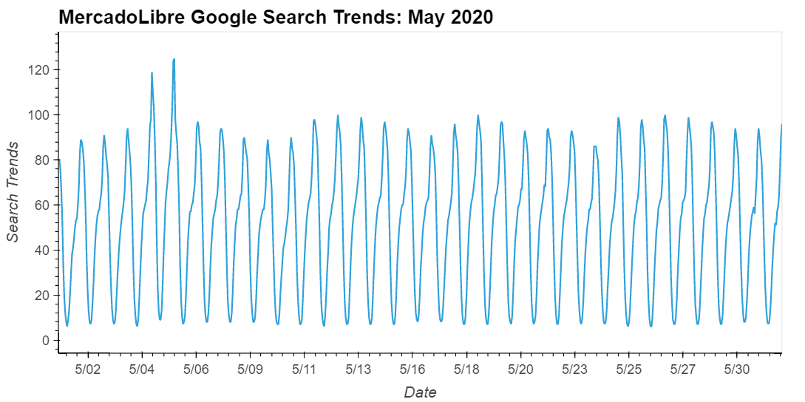
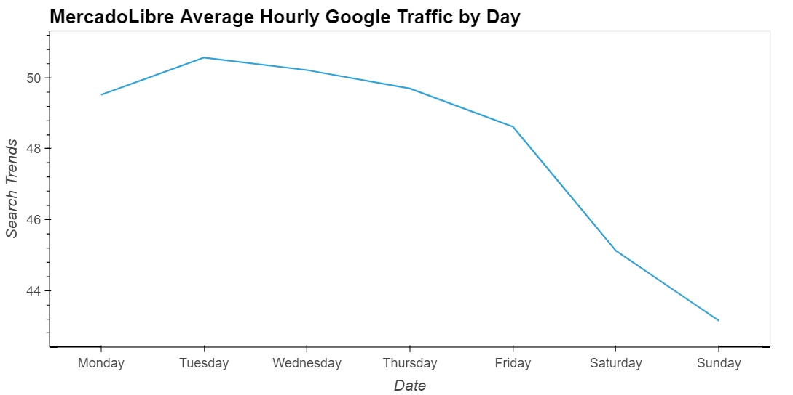
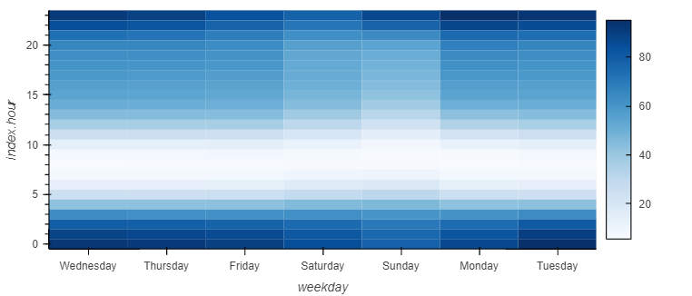
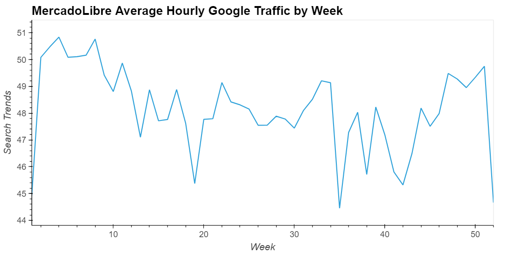
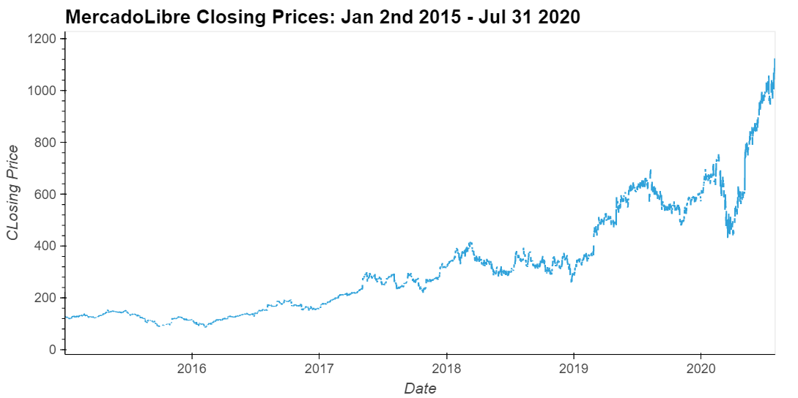
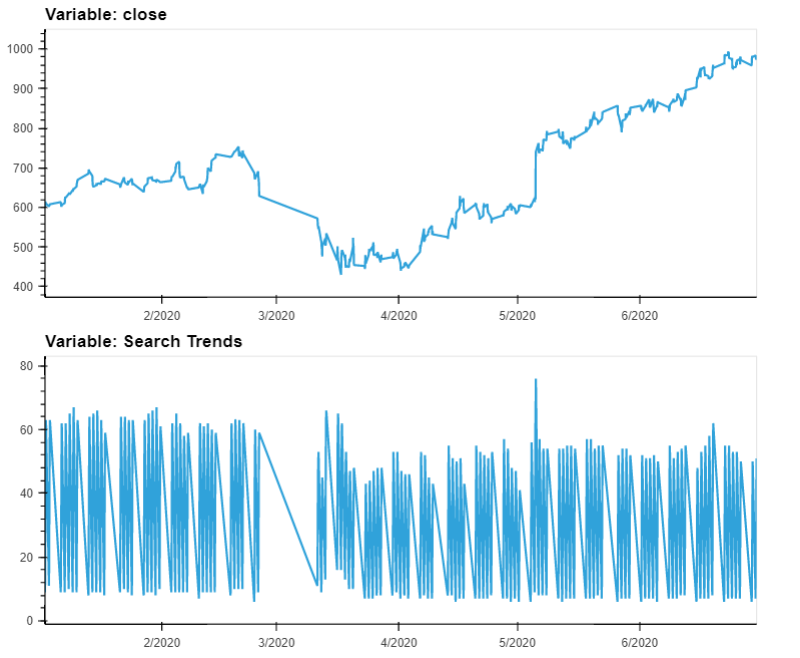
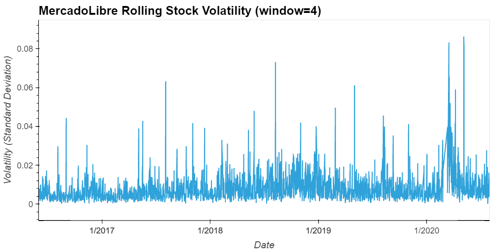
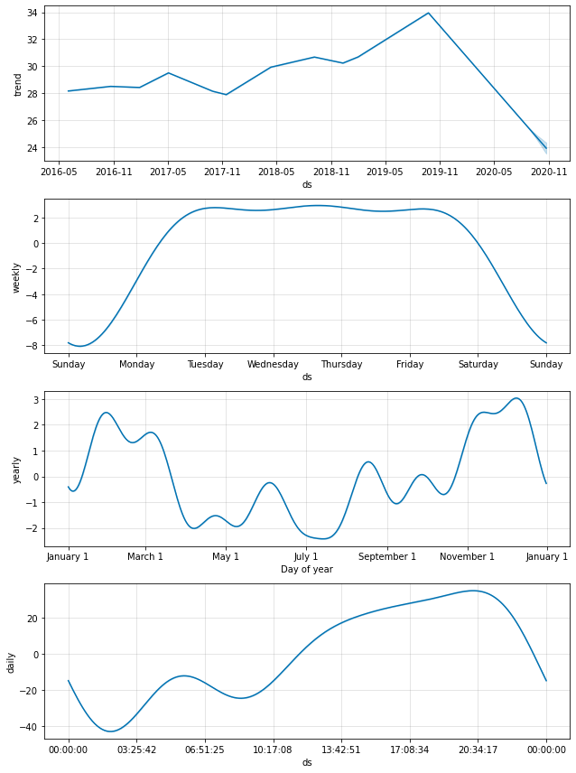

# MercadoLibre Forecasting with Prophet

With over 200 million users, MercadoLibre is the most popular e-commerce site in Latin America. This notebook analyzes the company's financial and user data to identify ways to make the company grow. It tests whether predicting search traffic can translate into the ability to successfully trade the stock.

## Technologies

The application uses the following technologies:

- Python 3.7
- [pandas](https://pandas.pydata.org/pandas-docs/stable/index.html)
- [Jupyter Lab](https://jupyter.org/)
- [PyViz (Holoviz)](https://hvplot.holoviz.org/)
- [Facebook Prophet](https://facebook.github.io/prophet/)
- [Google Colaboratory](https://colab.research.google.com/)

## Installation Guide

```python

pip install numpy
pip install pandas
pip install matplotlib
conda install -c pyviz hvplot geoviews
pip install -U scikit-learn

```

## Usage

### Google Colaboratory Configuration / Startup

The Jupyter Notebook in this repository is configured to run in the Google Colaboratory. Navigate to [Google Colaboratory](https://colab.research.google.com/) and upload the **forecasting_net_prophet_ipynb** file.  Note the following code in the Notebook that installs the necessary packages in Google Colaboratory.  If you wish to run in a standard Jupyter Notebook served locally, install the packages indicated.

```python

# Install the required libraries
from IPython.display import clear_output
try:
  !pip install pystan
  !pip install fbprophet
  !pip install hvplot
  !pip install holoviews
except:
  print("Error installing libraries")
finally:
  clear_output()
  print('Libraries successfully installed')

```

### Inputs

CSV files:

1. Resources/google_hourly_search_trends.csv
2. Resources/mercado_stock_price.csv

The Notebook is configured to run in Google Colaboratory. The tool will prompt for a file upload.  Upload the file that is being referenced in the cell. For instance when the code below runs one should upload the **google_hourly_search_trends.csv** when prompted.

```python

from google.colab import files
uploaded = files.upload()

df_mercado_trends = pd.read_csv('google_hourly_search_trends.csv',
                                index_col='Date', 
                                infer_datetime_format=True, 
                                parse_dates=True)

```

### Analysis Output Examples

















## Contributors

- Jacob Rougeau

## License

MIT
